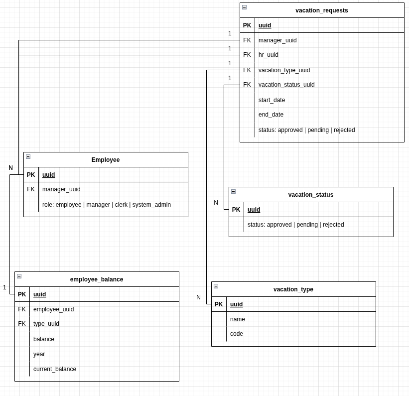
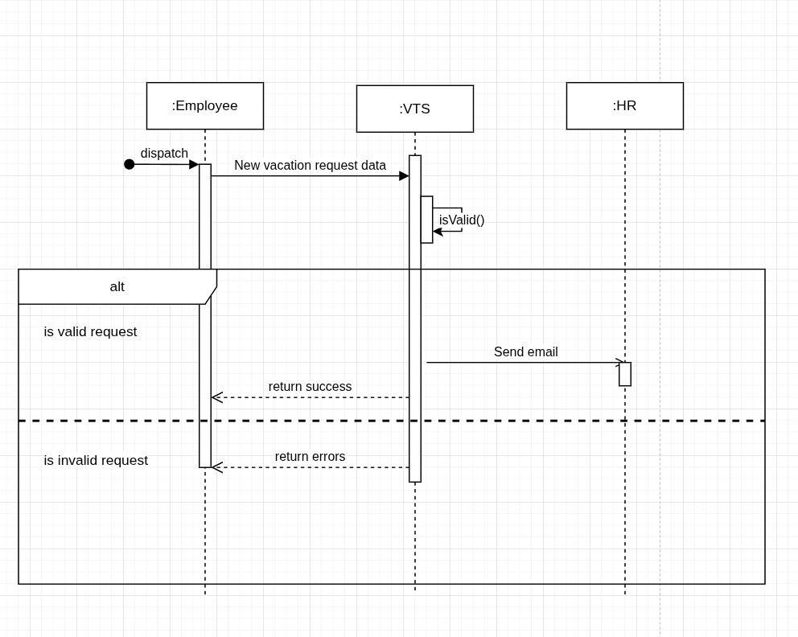
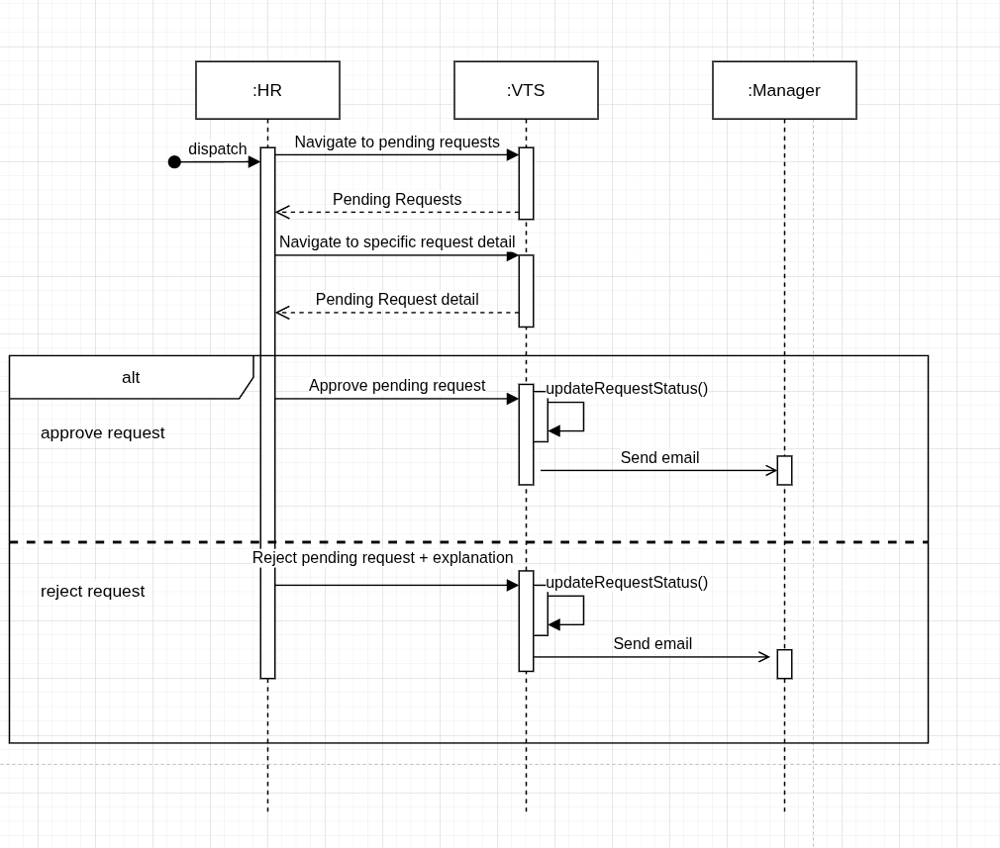
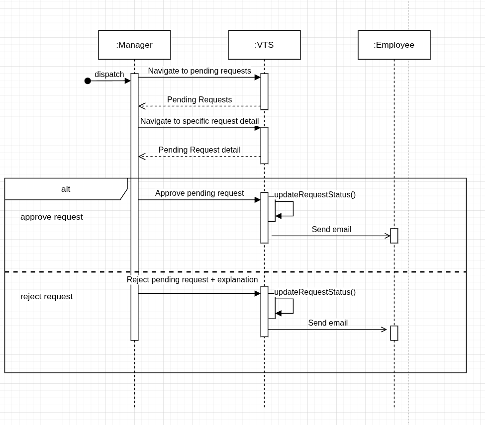
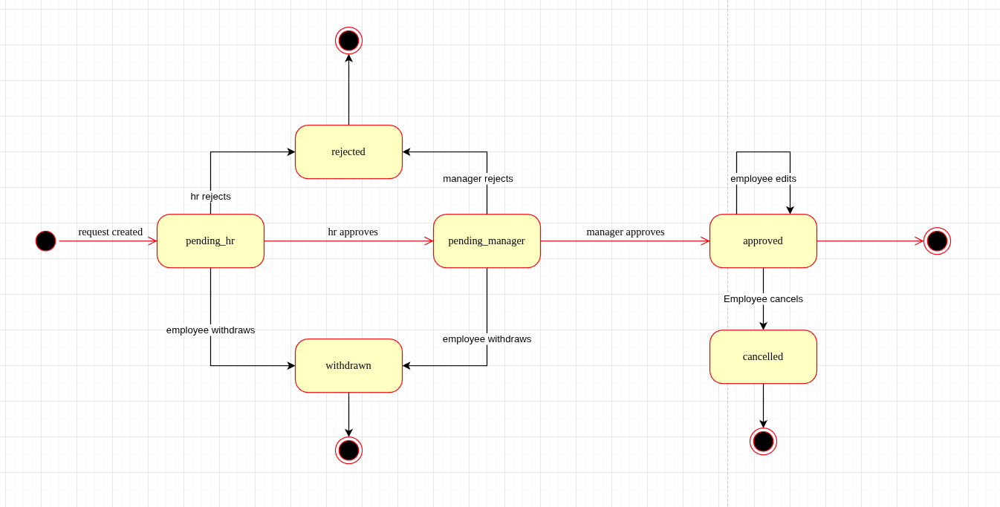

# Table of Contents

- [Table of Contents](#table-of-contents)
- [Vision](#vision)
- [Functional requirements](#functional-requirements)
- [Non-functional requirements](#non-functional-requirements)
- [Constraints](#constraints)
- [Domain (Define Problem)](#domain-define-problem)
- [Actors](#actors)
- [Use-cases](#use-cases)
  - [Manage Time](#manage-time)
    - [Flows](#flows)
      - [Create new Vacation Request](#create-new-vacation-request)
      - [Withdraw Vacation Request](#withdraw-vacation-request)
      - [Cancel Vacation Request](#cancel-vacation-request)
      - [Edit Pending Vacation Request](#edit-pending-vacation-request)
- [Challenges](#challenges)
  - [What if we were to add more approval levels (e.g. HR approval)?](#what-if-we-were-to-add-more-approval-levels-eg-hr-approval)
    - [Diagrams](#diagrams)
      - [ERD](#erd)
      - [Pseudocode](#pseudocode)
      - [Sequence Diagrams](#sequence-diagrams)
      - [State Machine Diagrams](#state-machine-diagrams)
- [Resources](#resources)

# Vision
1. A Vacation Tracking System (VTS) will provide individual employees with the capability to manage their own vacation time, sick leave, and personal time off, without having to be an expert in company policy or the local facility’s leave policies.

# Functional requirements
1. One manual approval by the immediate manager.
2. High-level employees may not require manager approval.
3. Implements a flexible rules-based system for validating and verifying leave time requests
4. Enables manager approval (optional)
5. Provides access to requests for the previous calendar year, and allows requests to be made up to a year and a half in the future
6. Uses e-mail notification to request manager approval and notify employees of request status changes
7. Uses existing hardware and middleware
8. Is implemented as an extension to the existing intranet portal system, and uses the portal’s single-sign-on mechanisms for all authentication
9. Keeps activity logs for all transactions
10. Enables the HR and system administration personnel to override all actions restricted by rules, with logging of those overrides
11. Allows managers to directly award personal leave time (with system-set limits)
12. Provides a Web service interface for other internal systems to query any given employee’s vacation request summary
13. Interfaces with the HR department legacy systems to retrieve required employee information and changes

# Non-functional requirements
1. System must be easy to use.
2. Improve internal business processes of the organization (with respect to vacation time tracking).
3. Save time & Money for HR Department.

# Constraints
1. Web Application
2. Extend existent intranet
3. Use existing hardware
4. Apply company policies for vacations

# Domain (Define Problem)
1. Employees work on many different projects
2. Said projects have different managers
3. Managers do not know when an employee has a vacation.

# Actors
1. Employees
2. Mangers
3. Clerk
4. System Admin

# Use-cases

## Manage Time

### Flows

#### Create new Vacation Request
1. [Flowchart](./.diagrams/use-cases/manage-time/flowcharts/create-new-request.png)
2. Sequence Diagrams
   1. [Authentication](./.diagrams/use-cases/manage-time/sequence-diagrams/create-new-request.png)
   2. [Create Request](./.diagrams/use-cases/manage-time/sequence-diagrams/create-new-request.png)
   3. [Manager Approve Request](./.diagrams/use-cases/manage-time/sequence-diagrams/create-new-request.png)
3. Pseudocode
   1. [Create new Request](./.diagrams/use-cases/manage-time/pseudocode/create-new-request.txt)
   2. [Manager Approve Request](./.diagrams/use-cases/manage-time/pseudocode/approve-vacation-request.txt)
   3. [Get Vacation Requests](./.diagrams/use-cases/manage-time/pseudocode/get-vacation-requests.txt)

#### Withdraw Vacation Request
1. [Flowchart](./.diagrams/use-cases/manage-time/flowcharts/withdraw-request.png)
2. [Sequence Diagram](./.diagrams/use-cases/manage-time/sequence-diagrams/withdraw-request.png)
3. [Pseudocode](./.diagrams/use-cases/manage-time/pseudocode/withdraw-request.txt)

#### Cancel Vacation Request
1. [Flowchart](./.diagrams/use-cases/manage-time/flowcharts/cancel-approved-request.png)
2. [Sequence Diagram](./.diagrams/use-cases/manage-time/sequence-diagrams/cancel-request.png)
3. [Pseudocode](./.diagrams/use-cases/manage-time/pseudocode/cancel-approved-request.txt)

#### Edit Pending Vacation Request
1. [Flowchart](./.diagrams/use-cases/manage-time/flowcharts/edit-pending-request.png)
2. [Sequence Diagram](./.diagrams/use-cases/manage-time/sequence-diagrams/edit-pending-request.png)
3. [Pseudocode](./.diagrams/use-cases/manage-time/pseudocode/edit-pending-request.txt)

# Challenges
## What if we were to add more approval levels (e.g. HR approval)?
1. Assumptions
   1. Manager approval takes precedence.
2. Changes
   1. Database & ERD:
      1. Seed two more statuses: `HR_PENDING` and `HR_APPROVED`.
      2. Add HR FK to `vacation_requests` table
   2. Create requests API:
      1. Send email to HR
      2. Set status to `HR_PENDING`
   3. Approve requests API:
      1. If HR approves, set status to `HR_APPROVED`, and send Email to Manager.
      2. If Manager approves, set status to `APPROVED`, send email to Employee.
      3. Otherwise, throw.
   4. Get Pending Vacation Requests API:
      1. Get relevant pending vacation requests to Employee, HR or Manager.
### Diagrams

#### ERD
1. Changed ERD

#### Pseudocode
1. Link to Pseudocode: [Pseudocode](./.diagrams/use-cases/challenges/extend-request-states/pseudocode/pseudocode.txt)

#### Sequence Diagrams
1. Create Vacation Request

2. Approve Vacation Request (HR Side) 

3. Approve Vacation Request (Manager Side)

#### State Machine Diagrams
States of Vacation Request

# Resources
1. Object Oriented Analysis and Design (OOAD) Chapter - 12